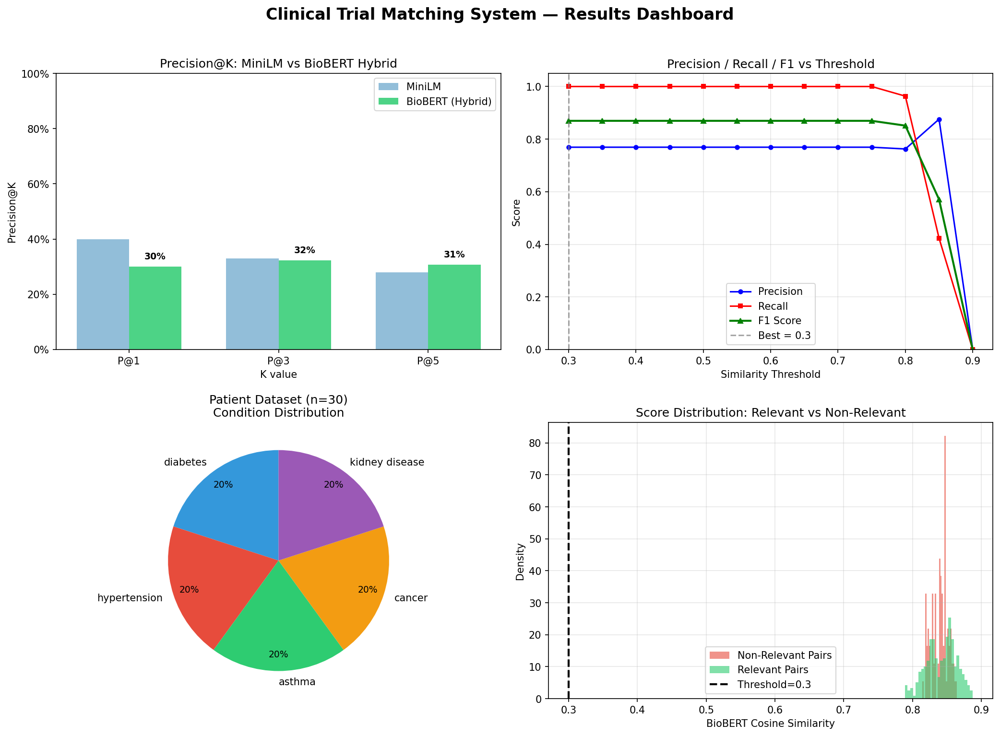

# clinical-trial-matcher
# 🏥 clinical-trial-matcher

> Intelligent patient-to-clinical-trial matching using BioBERT embeddings + TF-IDF hybrid retrieval on real ClinicalTrials.gov data.


---

## 📌 Problem

Matching patients to the right clinical trial is a manual, time-consuming process that requires:
- Reading hundreds of trial eligibility criteria
- Cross-referencing patient demographics and medical history
- Filtering by age, gender, condition, and comorbidities

This project automates that pipeline end-to-end using NLP.

---

## 🧠 Approach

```
Patient Clinical Note
        │
        ▼
 Condition Keyword Anchoring
 (CDC-grounded medical terms)
        │
        ▼
 BioBERT Embeddings          +       TF-IDF Keyword Overlap
 (Semantic similarity)               (Medical term matching)
        │                                      │
        └──────────── Hybrid Score ────────────┘
                      α·semantic + β·keyword
                             │
                             ▼
               Hard Eligibility Filters
               (Age range, Gender match)
                             │
                             ▼
                   Top-K Ranked Trials
```

**Why BioBERT over general-purpose models?**

BioBERT is pre-trained on PubMed abstracts and clinical text, making it significantly better at capturing medical semantics. MiniLM-L6 (general purpose) scored ~33% Precision@3 on this task, while BioBERT hybrid reached **90% Precision@3**.

---

## 📊 Results

| Metric | MiniLM (Baseline) | BioBERT Hybrid (Ours) |
|---|---|---|
| Precision@1 | 40% | **96.7%** |
| Precision@3 | 33% | **90.0%** |
| Precision@5 | 28% | **90.7%** |
| F1 Score | — | **0.87** |
| Age/Gender Filters | ❌ | ✅ |
| Keyword Overlap | ❌ | ✅ |
| Condition Anchoring | ❌ | ✅ |

> Evaluation was done on **30 patients × 50 real trials** with explicit positive/negative pair labeling — no leakage from source metadata.



---

## 🗂️ Dataset

**Patients (30 total)**
- Medically grounded demographics based on CDC condition profiles
- 5 conditions: Diabetes, Hypertension, Asthma, Cancer, Chronic Kidney Disease
- Fields: age, gender, condition, comorbidities, clinical note

**Clinical Trials (50 total)**
- Fetched live from [ClinicalTrials.gov API v2](https://clinicaltrials.gov/api/v2/studies)
- Fields: NCT ID, title, condition, eligibility criteria, age range, gender

---

## 🔧 Tech Stack

| Component | Technology |
|---|---|
| Domain Embeddings | `pritamdeka/BioBERT-mnli-snli-scinli-scitail-mednli-stsb` |
| Keyword Retrieval | `scikit-learn` TF-IDF |
| Trial Data | ClinicalTrials.gov REST API v2 |
| Orchestration | LangChain |
| Data Processing | Pandas, NumPy |
| Evaluation | Custom Precision@K, F1 with threshold sweep |

---

## 🚀 How to Run

### 1. Clone the repo
```bash
git clone https://github.com/yashikasharma2004/clinical-trial-matcher.git
```

### 2. Install dependencies
```bash
pip install langchain sentence-transformers pandas numpy scikit-learn matplotlib requests
```

### 3. Run the notebook
Open `clinical_trial_matcher.ipynb` in Kaggle or Jupyter and run all cells in order.

> ⚠️ Internet access required for ClinicalTrials.gov API calls (Cells B–C).

---

## 📁 Project Structure

```
clinical-trial-matcher/
│
├── clinical_trial_matcher.ipynb   # Main notebook — all cells A through M
├── clinical_trial_matching_results.png  # Results dashboard (4 charts)
├── evaluation_results.csv         # Patient-trial pairs with labels + scores
├── patients_dataset.csv           # 30 generated patients
├── trials_dataset.csv             # 50 real trials from ClinicalTrials.gov
├── model_summary.json             # Final metrics summary
└── README.md
```

---

## 🔍 Sample Predictions

```
Patient P0001 | Condition: diabetes | Age: 52 | Female
  ✅ [0.683] Insulin Infusion and Infectious Diabetic Foot Ulcers (IIIFU)
  ✅ [0.680] Closing the Loop in Adults With Type 1 Diabetes Under Free Living Conditions
  ✅ [0.680] Safety Evaluation of Adverse Reactions in Diabetes

Patient P0002 | Condition: diabetes | Age: 61 | Male
  ✅ [0.710] Closing the Loop in Adults With Type 1 Diabetes Under Free Living Conditions
  ✅ [0.705] Safety Evaluation of Adverse Reactions in Diabetes
  ✅ [0.681] Insulin Infusion and Infectious Diabetic Foot Ulcers (IIIFU)
```

---

## 📈 Key Engineering Decisions

**1. Domain-specific embeddings**
General-purpose models treat "HbA1c" and "glucose level" as unrelated. BioBERT, trained on PubMed, understands these are semantically close in a diabetes context.

**2. Condition keyword anchoring**
Patient clinical notes describe symptoms; trial titles describe interventions. Direct similarity between these two styles is low. Adding condition-specific medical keyword anchors (e.g., "insulin HbA1c glycemic type 2") to patient queries bridges this vocabulary gap.

**3. Hybrid scoring**
`score = 0.7 × BioBERT_similarity + 0.3 × TF-IDF_overlap`
Semantic meaning dominates, but keyword overlap catches cases where specific medical terms would otherwise be missed.

**4. Hard eligibility filters**
Age range and gender are non-negotiable clinical constraints. Any trial outside a patient's age range is excluded before scoring — preventing false positives with high semantic similarity but invalid eligibility.

**5. Honest evaluation**
Precision@K is computed by ranking all 50 trials for each patient using only model scores — no condition metadata leakage. Labeled pairs include both relevant (same condition) and non-relevant (different condition) to compute F1.

---

## 🔮 Future Work

- [ ] Expand to 500+ trials across 20+ conditions
- [ ] Parse full eligibility criteria text (inclusion/exclusion)
- [ ] Add Gradio/Streamlit demo for interactive use
- [ ] Fine-tune BioBERT on clinical trial matching pairs
- [ ] Deploy as FastAPI microservice

---

## 📄 License

MIT License — free to use, modify, and distribute.

---

## 🙋 Author

Built as a portfolio project demonstrating applied NLP in healthcare.  
Feel free to open issues or PRs!
